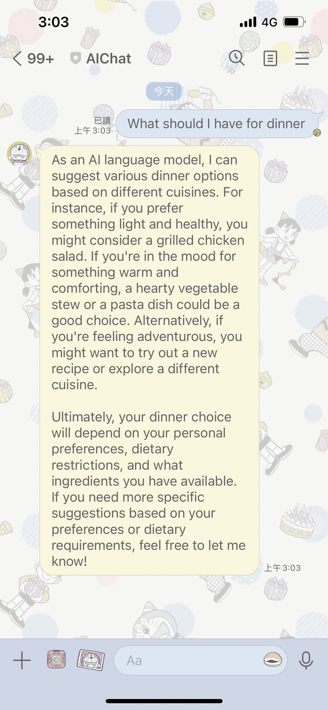

# gpt-LineBot

<h4>The project involves step by setp tutorial for implementing an intelligent LINE chatbot that integrates the OpenAI API with LINE developer tools.</h4>
  
<h4>Additionally, the functions are deployed on Google Cloud Functions, eliminating the need for self-hosted servers.</h4>



## LINE Developer

1. **First, go to [line developer](https://developers.line.biz/en/?status=success) and register for a LINE Developer account.**
   
2. **Create a provider based on the Messaging API.**
   
3. **Now, you can have a conversation with the default bot in the LINE app using the QR code found in the 'Messaging API' option.**
   
4. **In the 'Messaging API' option, locate the 'Webhook settings' and enable the 'Use webhook' option.**
   
5. **In the 'Messaging API' option, find the Channel access token and remember this token, as it will be used later.**

## Chat-gpt API

1. **Log in or register for an [OpenAI](https://openai.com/blog/openai-api) account.**
 
2. **After logging in, find the 'API Keys' option in the menu in the top left corner.**
   
3. **Create a new Secret Key and remember this key. This key will only be displayed once; if you miss it, you can delete it and create another one.**
   
4. **Ensure you have enough credits to use this API. If you don't have credits, you can still find the 'Settings' option in the top left corner menu, go to 'Billing', and purchase sufficient credits there.**

## Google Colud Function

1. **Log in or register for an [Google Cloud](https://cloud.google.com/apis) api account**
   
2. **Select the console in the upper right corner.**

3. **Search for Cloud Functions in the search field.**
 
4. **Click on CREATE FUNCTION.**
 
5. **Make some basic settings for the function, and remember to check the 'Allow unauthenticated invocations' option.**

6. **Under the 'Runtime, build connections and security settings', find 'Runtime environment variables', we need to Add two variables:**

   **in the Name1 field, enter API_KEY and in Value1, input the OpenAI Secret Key you copied earlier;**

   **in the Name2 field, enter LINE_ACCESS_TOKEN and in Value2, input the Channel access token you copied earlier.**
    
8. **After filling in all the details, click on ADD TRIGGER to create a new function.**

9. **You will see two files, main.py and requirement.txt. Copy the corresponding code from this repository. Be aware that the model and the API endpoints below may change over time, so please pay attention to the official documentation.**

```
https://api.openai.com/v1/chat/completions

gpt-3.5-turbo-1106

https://api.line.me/v2/bot/message/reply
```

9. **Next, click on the deploy option and copy the URL that is generated.**
    
10. **Return to the LINE Developer page, find 'Messaging API' and in the 'Webhook settings', paste the URL you just generated into the 'Webhook URL'. This is the final step, and now your LINE bot should be operational.**

